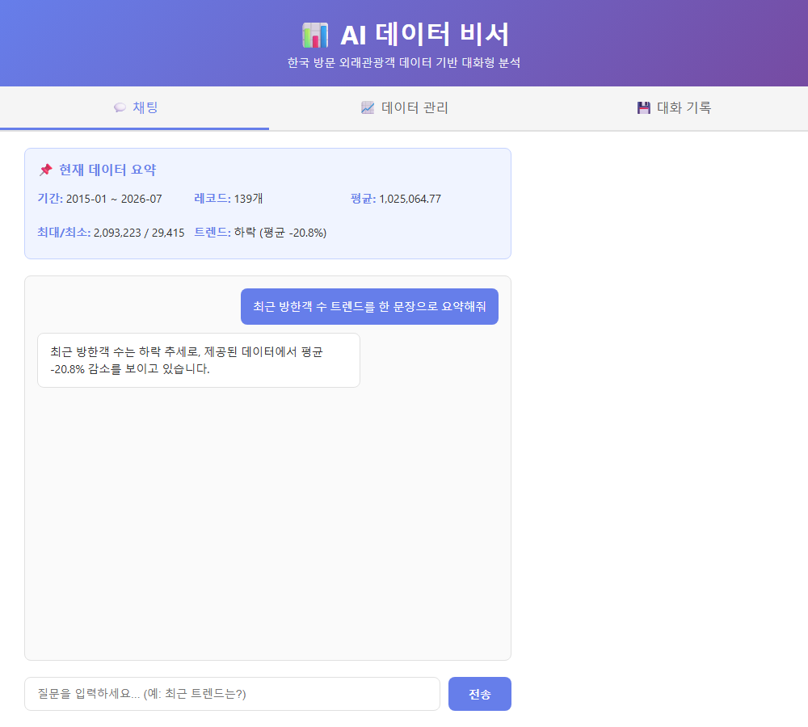
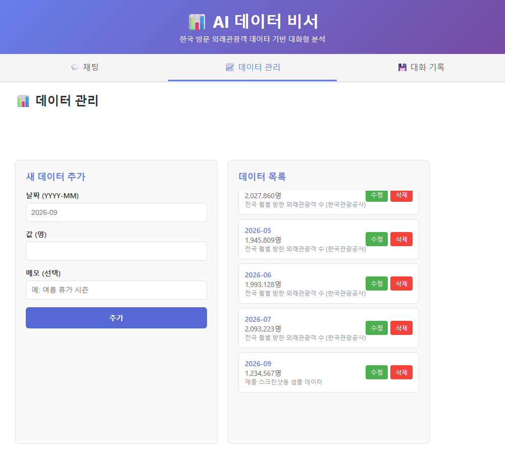
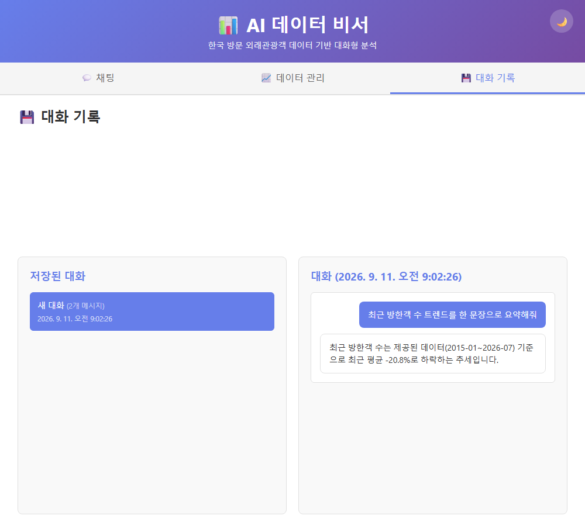
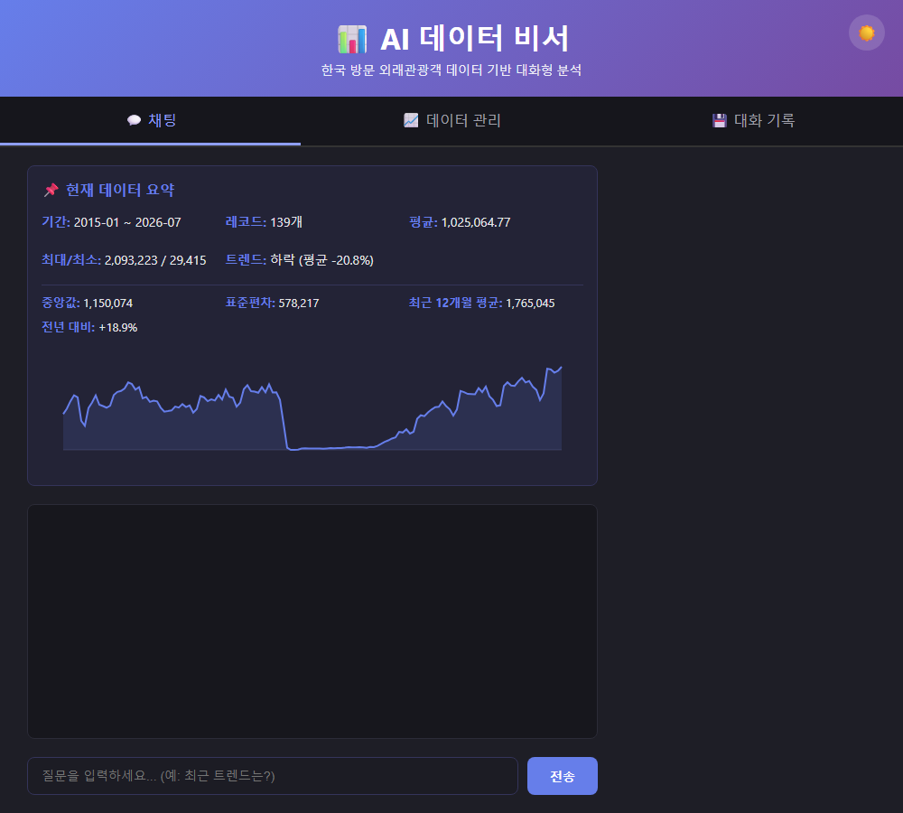
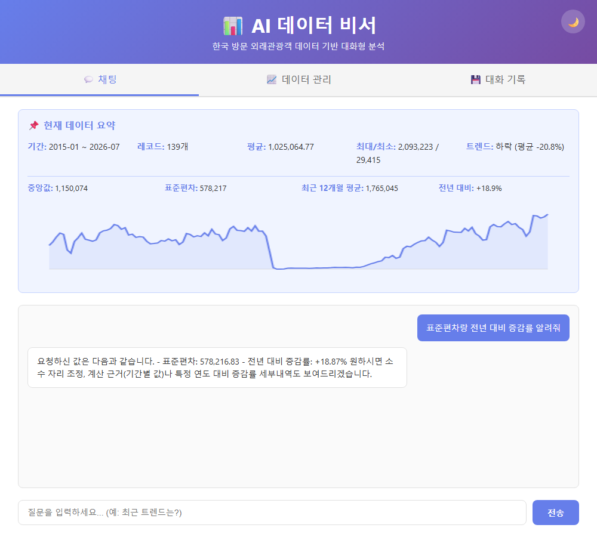

# M1-2 — AI Agent 개발: 나만의 AI 비서 구축

저장소: <https://github.com/linkcontent7-huisun/M1-2>

## 개요

한국관광공사의 **월별 방한 외래관광객 수**를 시계열로 분석하고, 요약 결과를 시스템 프롬프트에
주입해 대화하는 AI 데이터 비서. FastAPI + Firestore + GPT API로 백엔드를 구성하고,
바닐라 HTML/CSS/JS로 프론트엔드를 만들어 Render/Vercel에 배포한다.

이 과제는 [M1-1](https://github.com/linkcontent7-huisun/M1-1-tourism-trend)에서
검증한 한국관광 데이터랩 데이터를 재사용한다. 2015-01~2026-07의 139개 월별 관측치를 포함해
과제의 100건 이상 시계열 요건을 충족한다. 이 지표는 향후 visitholykorea(가톨릭 성지순례 앱)의
해외 이용자 저변을 가늠하는 참고 지표이며, 나아가 코디세이 Final Project 캡스톤으로 이어지도록
설계했다.
자세한 근거는 [`specs/tech-stack-analysis.md`](specs/tech-stack-analysis.md) 참고.

## 요구사항 체크리스트

[`specs/requirements-checklist.md`](specs/requirements-checklist.md)

## 진행 상태

✅ 필수 요구사항(1~10번) 전부 완료 및 배포 사이트에서 실사용 검증 — FastAPI 백엔드(Render)·
프론트엔드(Vercel)·Firestore 139건 적재·AI 채팅(코디세이 공개 API) 정상 작동, 채팅/대화기록의
숨어있던 버그 2건 발견·수정
✅ 보너스 과제 5/5 완료 — 추가 통계 지표, 추세 그래프, CSV/JSON 내보내기, 다크 모드,
Function Calling + MCP Server 연동 — 2026-09-11

## 프로젝트 구조

```
main.py                  FastAPI 앱 생성, CORS, 라우터 연결, 공통 예외 처리
app/
├── config.py             환경 변수 로드
├── firebase.py           Firestore 클라이언트 (지연 초기화)
├── openai_client.py      OpenAI 클라이언트 (지연 초기화)
├── schemas/               Pydantic 요청/응답 모델
│   ├── data.py
│   ├── conversation.py
│   └── chat.py
├── services/               비즈니스 로직 (Firestore 읽기/쓰기, 통계, GPT 호출)
│   ├── data_service.py
│   ├── conversation_service.py
│   └── chat_service.py
└── routers/                 HTTP 엔드포인트만 담당(얇게 유지)
    ├── data.py
    ├── conversations.py
    └── chat.py
```

## 실행 방법

```bash
python -m venv .venv
.venv\Scripts\activate
pip install -r requirements.txt
cp .env.example .env   # 값 채우기
uvicorn main:app --reload
```

`http://localhost:8000/docs`에서 Swagger UI 확인. Firebase/OpenAI 키가 없어도 서버는
뜨고 `/docs`는 보이지만, 실제 데이터 API를 호출하면 `503`으로 어떤 환경 변수가
빠졌는지 알려준다(코드 하드코딩 없이 지연 초기화하도록 설계).

## 실데이터 적재

[`data/foreign_visitors_monthly.csv`](data/foreign_visitors_monthly.csv)는 한국관광공사 관광데이터랩의
월별 방한 외래관광객 수 139건(2015-01~2026-07)이다. 먼저 CSV를 검증하고, Firebase 환경 변수를
연결한 후 Firestore에 적재한다.

```bash
python scripts/import_foreign_visitors.py --dry-run
python scripts/import_foreign_visitors.py
```

두 번째 명령은 동일한 월(`date`)이 이미 있으면 건너뛰므로 재실행해도 중복 적재하지 않는다.
첫 적재 전 Firebase Console에서 해당 프로젝트의 **Cloud Firestore API**와 Firestore 데이터베이스를
활성화해야 한다.

## 환경 변수

| 변수명 | 설명 |
|---|---|
| `OPENAI_API_KEY` | OpenAI(호환) API 키 |
| `OPENAI_BASE_URL` | (선택) OpenAI 호환 엔드포인트. 비우면 OpenAI 공식 서버를 쓴다 |
| `OPENAI_MODEL` | 채팅에 쓸 모델명 |
| `OPENAI_MAX_TOKENS` | 응답 최대 토큰 수 |
| `FIREBASE_SERVICE_ACCOUNT_JSON` | Firebase 서비스 계정 키(JSON) |
| `API_BASE_URL` | 프론트엔드가 호출할 백엔드 주소 |
| `ALLOWED_ORIGINS` | CORS 허용 도메인 |

### 코디세이 공개 API 사용

개인 OpenAI 계정 크레딧 대신 코디세이 공개 API(기관 키로 정산)를 쓴다.
`OPENAI_API_KEY`에 `sk-cody-live-...` 형식의 키를, `OPENAI_BASE_URL`에
`https://copa.codyssey.kr/v1`(경로 끝의 `/v1` 필수 — OpenAI SDK가
`{base_url}/chat/completions`로 요청을 만든다)을 넣는다. `gpt-5-mini`는
추론(reasoning) 모델이라 `OPENAI_MAX_TOKENS`를 넉넉히(800 이상) 잡지 않으면
빈 응답이 온다.

## 배포 방법

### 1. 필수 환경 변수 준비

Firebase 프로젝트 설정:
1. [Firebase Console](https://console.firebase.google.com)에서 프로젝트 생성
2. **Firestore Database** 활성화 (시작 모드 선택)
3. **Cloud Firestore API** 활성화
4. 서비스 계정 키 생성: `프로젝트 설정` → `서비스 계정` → `새 개인 키 생성` → JSON 다운로드

OpenAI API 키 준비:
1. [OpenAI API](https://platform.openai.com/api/keys)에서 API 키 생성

### 2. Render 배포 (백엔드)

```bash
# GitHub에 푸시되어 있다고 가정
# Render 웹사이트에서:
# 1. "Create" → "Web Service" → GitHub 계정 연결
# 2. 저장소 선택: linkcontent7-huisun/M1-2
# 3. "Environment" 탭에서 환경 변수 추가:
#    - OPENAI_API_KEY: <OpenAI API 키>
#    - FIREBASE_SERVICE_ACCOUNT_JSON: <Firebase JSON 전체 문자열 또는 경로>
#    - ALLOWED_ORIGINS: https://<vercel-frontend-url>
# 4. Deploy 클릭
```

**주의:** Render 무료 티어는 콜드스타트가 있습니다. 첫 요청 시 15초 이상 걸릴 수 있습니다.

### 3. Vercel 배포 (프론트엔드)

```bash
# GitHub에 푸시되어 있다고 가정
# Vercel 웹사이트에서:
# 1. "Add New" → "Project" → GitHub 계정 연결
# 2. 저장소 선택: linkcontent7-huisun/M1-2
# 3. "Output Directory": public
# 4. "Environment Variables" 탭에서:
#    - VITE_API_BASE_URL: <Render 백엔드 URL> (예: https://m1-2-backend.onrender.com)
# 5. Deploy 클릭
```

또는 로컬에서 배포:

```bash
npm install -g vercel  # vercel CLI 설치
cd C:\Users\noh hui sun\codyssey\assignments\M1-2
vercel --prod
```

## 배포 URL

| 환경 | URL |
|---|---|
| 프론트엔드 | <https://m1-2-peach.vercel.app> |
| 백엔드 API | <https://m1-2-2pob.onrender.com> |
| Swagger UI | <https://m1-2-2pob.onrender.com/docs> |

**주의:** Render 무료 티어는 비활동 시 슬립되어 첫 요청이 50초 이상 걸릴 수 있다.

## 제출 스크린샷

배포된 서비스를 직접 조작해 캡처했다 (`scripts/take_screenshots.py`).

| 채팅 (질문+답변+데이터 요약+추가 통계+추세 그래프) | 데이터 관리 (추가 동작+내보내기) | 대화 기록 (목록+불러오기) | 다크 모드 |
|---|---|---|---|
|  |  |  |  |

**Function Calling 실제 동작** — "표준편차랑 전년 대비 증감률 알려줘"라고 물으면 GPT가
`get_data_statistics` 도구를 호출해 화면 상단 통계(578,217 / +18.9%)와 정확히 일치하는
값으로 답한다.



## 보너스 과제

### 1. 인사이트·UX 고도화

| 항목 | 구현 |
|---|---|
| 추가 지표 | `GET /api/data/statistics` — 중앙값·표준편차·최근 12개월 평균·전년 대비 증감률 |
| 시각화 그래프 | 채팅 탭 요약 아래에 바닐라 Canvas로 139개월 추세 라인 그래프(외부 차트 라이브러리 없이 구현) |
| 데이터 내보내기 | 데이터 관리 탭에서 CSV/JSON 다운로드 버튼 |
| 다크 모드 | 헤더 토글, `localStorage`에 저장해 새로고침 후에도 유지 |

### 2. AI 도구 호출(Function Calling) + MCP Server 연동

**코디세이 공개 API가 OpenAI 표준 Function Calling을 지원하는지부터 실측으로 확인했다** —
`tools` 파라미터를 넣어 직접 호출해보니 `tool_calls`/`finish_reason: "tool_calls"`가 표준
스펙 그대로 돌아왔다. 이후 실제 구현으로 이어졌다.

**호출 흐름** (`app/services/chat_service.py`):

```
사용자 질문
  → GPT 호출 (tools=[get_data_statistics, search_data_by_period] 포함)
  → GPT가 "요약에 없는 정보가 필요하다"고 판단하면 tool_calls를 반환
      (예: "표준편차 알려줘" → get_data_statistics 호출 요청)
  → 서버가 실제로 해당 내부 함수를 실행(Firestore 조회)
  → 결과를 role:"tool" 메시지로 넣어 재호출 (최대 4회 반복)
  → GPT가 이 결과를 반영한 자연어 답변 생성
  → 사용자에게 응답 + conversations에 최종 질문/답변만 저장
```

어떤 도구를 언제 호출할지는 **GPT 스스로 판단**한다(`tool_choice: "auto"`). 시스템
프롬프트에 이미 요약(기간/개수/평균/최대/최소/추세)이 박혀 있으므로, 그 안에 없는
질문 — "중앙값은?", "2020년 코로나 시기 수치는?" 같은 — 에서만 도구를 호출하는 것을
실제 대화로 확인했다. 일반적인 질문("트렌드 한 줄 요약해줘")에는 도구를 호출하지 않는다.

**동일 기능을 MCP Server로도 노출** (`mcp_server.py`) — 외부 MCP 클라이언트(Claude Desktop 등)에서
같은 세 도구(`get_data_summary`, `get_data_statistics`, `search_data_by_period`)를 호출할 수
있다. `app/services/data_service.py`를 그대로 재사용해 챗봇의 Function Calling과 동일한
데이터 소스를 쓴다.

```bash
pip install "mcp[cli]"
python mcp_server.py   # stdio로 실행, Claude Desktop 등에 등록해서 사용
```

**시행착오 두 가지** (실측 없이 넘어갔다면 몰랐을 것들):
1. OpenAI SDK의 `message.model_dump()`를 그대로 재전송하면 코디세이 API가 모르는
   부가 필드(`refusal` 등) 때문에 `400 unsupported_feature`가 난다 — 표준 스펙에
   필요한 필드만 추려 넣도록 고쳤다.
2. `search_data_by_period`가 원본 레코드를 통째로 반환하면, 추론(reasoning) 모델인
   `gpt-5-mini`가 다음 라운드에서 reasoning에 토큰을 다 쓰고 빈 응답을 내는 경우가
   있었다 — 반환값을 요약 통계+대표 샘플로 줄이고, 도구 호출 루프가 한도(4회) 안에
   끝나지 않으면 `tool_choice: "none"`으로 강제 마무리하는 안전장치를 추가했다.
